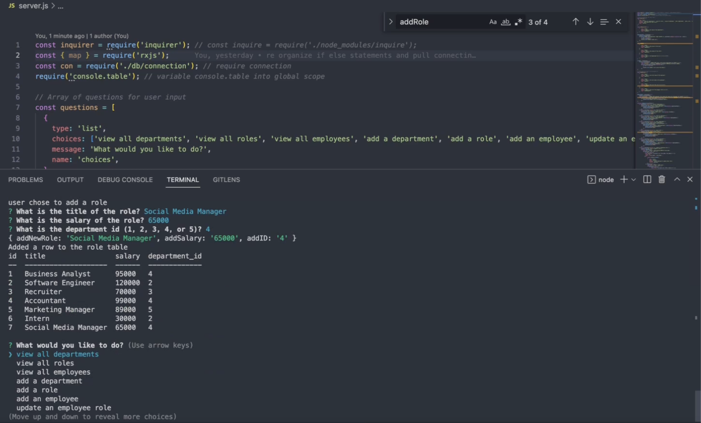

# Employee Database Navigation with MySQL
 
Navigate through a mock employee database where you can view all departments, view all roles, view all employees, add a department, add a role, add an employee, and update an employee role using Node js and MySQL.

  ## Description
  Use the terminal to view business departments, roles, and employee information. Option to add information to each database and update employee roles.
   
  
  ## Table of Contents
  * [Installation](#installation)
  * [Usage](#usage)
  * [Contributing](#contributing)
  * [Tests](#tests)
  * [Questions](#questions)
   
  
  ## Installation
  To install necessary dependencies, run the following command:
  npm i inquirer@8.2.4
   
  
  ## Usage
  Run "SOURCE schema.sql, "SOURCE seeds.sql" and SOURCE "query.sql" after installing inqiurer. Then run node server to launch the application.
   
  ### Demo
  Click on the image to view the video.
   
   
   
  Demo on [GitHub](https://github.com/malxxy/employee-database/blob/main/demo/employeeDatabaseWalkthrough.mp4) 

  
  ## License
 N/A
   
  
  ## Contributing
  N/A
   

  ## Tests
  To run tests, run the following commands
  npm test
   
  
  ## Questions
  If you have any questions about the repo or project, please contact me directly at maliayraguen@gmail.com.